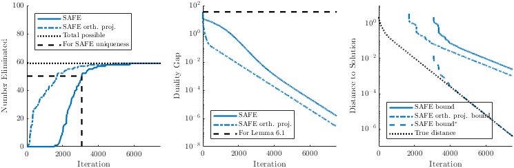

# Safe Feature Elimination for Non-Negativity Constrained Convex Problems
This repo has simple examples of safe feature elimination (SAFE) for convex problems with a non-negativity constraint.
Our method is described in [Safe Feature Elimination for Non-Negativity Constrained Convex Optimization](https://arxiv.org/abs/1907.10831) (Folberth and Becker, 2019), which was inspired by [Safe feature elimination for the lasso and sparse supervised learning problems](https://arxiv.org/abs/1009.4219).

## Small NNLS example
To run through the small NNLS example in Section 6.1 of our paper
```matlab
small_nnls_example
```

This example performs the cheap dual line search via
```
nu_hat = dual_line_search(A, nu, nu_strict);
```

and the basic feature elimination subproblem (10) via
```
lower_bounds = feat_elim_dual_strong_concavity(A, nu_hat, L, gap);
```

## Certifying Uniqueness
To recreate Figure 4 of our paper, you'll need the following:
 * `quadprog` from the optimization toolbox
 * [CVX](http://cvxr.com/cvx/)
 * you'll also need to compile a mex file.
   Ensure that you've got `mex` set up properly with a compiler that implements OpenMP, and then run `make`.
   This will compile `NNLS_all_inds_dome_subproblem_mex.cc`, which solves the "all index dome subproblem" in equation (20) of our paper.
   Note that this is the same routine used in the large-scale NNLS problems from our microscopy example (hence the use of OpenMP).

Once you've got the above in order, you should be able to run the following to generate the figure.
```matlab
make_fig4
```



## Authors
The authors are [James Folberth](https://jamesfolberth.org) and [Stephen Becker](https://amath.colorado.edu/faculty/becker/) ([University of Colorado Applied Math](https://www.colorado.edu/amath/))
